# CropAI India Workflow & System Diagrams

## 🎯 Main Platform Workflow (Improved Visibility)

Copy this code to Mermaid Live Editor: https://mermaid.live/

```mermaid
flowchart TD
    A["👨‍🌾 Farmer Registration<br/>Create Account & Profile"] --> B["📍 Location Setup<br/>State, District, Village"]
    B --> C["🌾 Crop Selection<br/>Choose Crops & Seasons"]
    C --> D["📊 Dashboard Access<br/>Personalized Interface"]
    
    D --> E["🤖 AI Analysis<br/>Data Processing"]
    D --> F["📈 Market Intelligence<br/>Price & Demand Data"]
    D --> G["🌦️ Weather Insights<br/>Climate Monitoring"]
    D --> H["💬 Chat Support<br/>AI Assistant"]
    
    E --> I["🎯 Yield Predictions<br/>95% Accuracy"]
    E --> J["🛡️ Risk Assessment<br/>Threat Analysis"]
    E --> K["🌱 Crop Recommendations<br/>Optimal Varieties"]
    
    F --> L["💰 Price Forecasting<br/>Market Trends"]
    F --> M["📊 Demand Analysis<br/>Supply-Demand"]
    F --> N["🔔 Market Alerts<br/>Selling Opportunities"]
    
    G --> O["⚠️ Weather Warnings<br/>Storm Alerts"]
    G --> P["🌧️ Monsoon Predictions<br/>Rainfall Forecast"]
    G --> Q["🏜️ Drought Alerts<br/>Water Scarcity"]
    
    H --> R["🧠 Personalized Advice<br/>Custom Solutions"]
    H --> S["📱 Real-time Support<br/>24/7 Assistance"]
    H --> T["📚 Knowledge Base<br/>Best Practices"]
    
    I --> U["📋 Action Plans<br/>Implementation"]
    J --> U
    K --> U
    L --> V["💡 Decision Making<br/>Strategic Choices"]
    M --> V
    N --> V
    O --> W["🚨 Emergency Response<br/>Crisis Management"]
    P --> W
    Q --> W
    R --> X["📈 Improved Yields<br/>Better Results"]
    S --> X
    T --> X
    
    U --> Y["🌾 Optimal Farming<br/>Enhanced Productivity"]
    V --> Y
    W --> Y
    X --> Y
    
    Y --> Z["💰 Increased Profits<br/>Financial Success"]
    
    %% Styling for better visibility
    classDef userInput fill:#e3f2fd,stroke:#1976d2,stroke-width:2px,color:#000
    classDef aiProcess fill:#f3e5f5,stroke:#7b1fa2,stroke-width:2px,color:#000
    classDef marketData fill:#e8f5e8,stroke:#388e3c,stroke-width:2px,color:#000
    classDef weatherData fill:#fff3e0,stroke:#f57c00,stroke-width:2px,color:#000
    classDef support fill:#fce4ec,stroke:#c2185b,stroke-width:2px,color:#000
    classDef outcome fill:#e0f2f1,stroke:#00695c,stroke-width:3px,color:#000
    
    class A,B,C,D userInput
    class E,I,J,K aiProcess
    class F,L,M,N marketData
    class G,O,P,Q weatherData
    class H,R,S,T support
    class U,V,W,X,Y,Z outcome
```

## 🏗️ System Architecture Diagram

## 🔄 Data Flow Sequence Diagram

```mermaid
sequenceDiagram
    participant F as 👨‍🌾 Farmer
    participant UI as 📱 Web App
    participant API as 🚪 API Gateway
    participant AI as 🤖 AI Engine
    participant DB as 🗄️ Database
    participant EXT as 🌍 External APIs
    
    F->>UI: Login & Select Crops
    UI->>API: Send User Request
    API->>DB: Fetch User Profile
    DB->>API: Return Profile Data
    
    API->>EXT: Get Weather Data
    API->>EXT: Get Market Prices
    API->>EXT: Get Satellite Images
    
    EXT->>API: Return Real-time Data
    API->>AI: Process Data with ML
    AI->>API: Return Predictions
    
    API->>DB: Store Results
    API->>UI: Send Recommendations
    UI->>F: Display Insights
    
    Note over F,EXT: Real-time Agricultural Intelligence
```

## 📈 User Journey Flowchart

```mermaid
flowchart LR
    Start([🚀 User Visits Platform]) --> Register{👤 New User?}
    
    Register -->|Yes| Signup[📝 Sign Up Process]
    Register -->|No| Login[🔑 Login]
    
    Signup --> Profile[👨‍🌾 Complete Profile]
    Profile --> Location[📍 Set Location]
    Location --> Crops[🌾 Select Crops]
    
    Login --> Dashboard[📊 Dashboard]
    Crops --> Dashboard
    
    Dashboard --> Features{🎯 Choose Feature}
    
    Features -->|AI Analysis| AIPath[🤖 AI Predictions]
    Features -->|Market Data| MarketPath[💰 Market Intelligence]
    Features -->|Weather| WeatherPath[🌦️ Weather Insights]
    Features -->|Chat| ChatPath[💬 AI Assistant]
    
    AIPath --> Results[📈 View Results]
    MarketPath --> Results
    WeatherPath --> Results
    ChatPath --> Results
    
    Results --> Action{⚡ Take Action?}
    Action -->|Yes| Implement[✅ Implement Advice]
    Action -->|No| Dashboard
    
    Implement --> Success[🎉 Improved Farming]
    Success --> Dashboard
    
    classDef startEnd fill:#e8f5e8,stroke:#4caf50,stroke-width:3px,color:#000
    classDef process fill:#e3f2fd,stroke:#2196f3,stroke-width:2px,color:#000
    classDef decision fill:#fff3e0,stroke:#ff9800,stroke-width:2px,color:#000
    classDef success fill:#e0f2f1,stroke:#00695c,stroke-width:2px,color:#000
    
    class Start,Success startEnd
    class Signup,Profile,Location,Crops,Dashboard,AIPath,MarketPath,WeatherPath,ChatPath,Results,Implement process
    class Register,Features,Action decision
```

## 🧠 AI/ML Pipeline Architecture

```mermaid
flowchart TB
    subgraph "📥 Data Ingestion"
        Satellite[🛰️ Satellite Imagery<br/>Real-time Monitoring]
        IoT[📡 IoT Sensors<br/>Soil & Weather Data]
        Historical[📊 Historical Data<br/>10+ Years Records]
        Market[💰 Market Data<br/>Price & Demand]
    end
    
    subgraph "🔄 Data Processing"
        Clean[🧹 Data Cleaning<br/>Validation & Normalization]
        Feature[⚙️ Feature Engineering<br/>Variable Creation]
        Integrate[🔗 Data Integration<br/>Multi-source Fusion]
    end
    
    subgraph "🤖 Machine Learning Models"
        Yield[📈 Yield Prediction<br/>Random Forest + XGBoost]
        Price[💹 Price Forecasting<br/>LSTM + ARIMA]
        Risk[⚠️ Risk Assessment<br/>SVM + Neural Networks]
        Recommend[🎯 Crop Recommendation<br/>Collaborative Filtering]
    end
    
    subgraph "🔍 Model Validation"
        Test[🧪 A/B Testing<br/>Model Performance]
        Validate[✅ Cross Validation<br/>Accuracy Assessment]
        Monitor[📊 Model Monitoring<br/>Drift Detection]
    end
    
    subgraph "📤 Output Generation"
        Insights[💡 Actionable Insights<br/>Farmer Recommendations]
        Alerts[🚨 Real-time Alerts<br/>Critical Notifications]
        Reports[📋 Detailed Reports<br/>Analytics Dashboard]
    end
    
    Satellite --> Clean
    IoT --> Clean
    Historical --> Clean
    Market --> Clean
    
    Clean --> Feature
    Feature --> Integrate
    
    Integrate --> Yield
    Integrate --> Price
    Integrate --> Risk
    Integrate --> Recommend
    
    Yield --> Test
    Price --> Validate
    Risk --> Monitor
    Recommend --> Test
    
    Test --> Insights
    Validate --> Alerts
    Monitor --> Reports
    
    classDef input fill:#e3f2fd,stroke:#1976d2,stroke-width:2px,color:#000
    classDef process fill:#f3e5f5,stroke:#7b1fa2,stroke-width:2px,color:#000
    classDef ml fill:#e8f5e8,stroke:#388e3c,stroke-width:2px,color:#000
    classDef validate fill:#fff3e0,stroke:#f57c00,stroke-width:2px,color:#000
    classDef output fill:#e0f2f1,stroke:#00695c,stroke-width:2px,color:#000
    
    class Satellite,IoT,Historical,Market input
    class Clean,Feature,Integrate process
    class Yield,Price,Risk,Recommend ml
    class Test,Validate,Monitor validate
    class Insights,Alerts,Reports output
```

## Instructions for Using These Diagrams:

### 📥 **Download Instructions:**
1. Go to https://mermaid.live/
2. Copy any of the diagram codes above (without the markdown backticks)
3. Paste it in the editor
4. Customize colors/styling if needed
5. Click "Download SVG" or "Download PNG" button
6. Save the high-quality image

### 🎨 **Diagram Features:**
- **Improved Visibility**: Added detailed descriptions in boxes
- **Better Color Coding**: Different categories have distinct colors
- **Dark Text**: All text is black (#000) for better readability
- **Professional Styling**: Clean borders and consistent spacing
- **Multiple Views**: System architecture, data flow, user journey, and AI pipeline

### 📊 **Available Formats:**
- **SVG**: Vector format (best for presentations, scalable)
- **PNG**: Raster format (good for web/documents)
- **PDF**: For formal documents

Use these diagrams in presentations, documentation, or anywhere you need to explain your CropAI India platform!